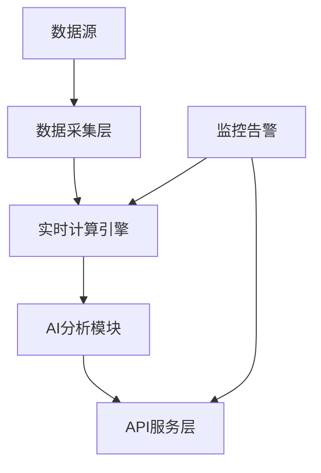

# AI股票信息平台技术方案

## 一、系统架构


## 二、技术栈清单
| 模块            | 技术方案                          | 版本   |
|-----------------|-----------------------------------|--------|
| 开发语言        | Go                                | 1.21+  |
| Web框架         | Gin + gRPC-Gateway               | v1.9.1 |
| 流处理          | NATS Streaming                   | 2.10.3 |
| 时序数据库      | TimescaleDB                      | 2.11.1 |
| 消息格式        | Protocol Buffers                 | 3.21.12|
| 容器编排        | Kubernetes(k3s)                 | v1.28  |
| 基础设施        | AWS EKS + S3                    | -      |

## 三、核心模块实现

### 1. 数据采集服务
```go
// pkg/collector/tushare.go
type QuoteFetcher interface {
    FetchRealtime(codes []string) ([]model.StockQuote, error)
}

type TushareAdapter struct {
    client *tushare.APIClient
}

func (t *TushareAdapter) FetchRealtime(codes []string) ([]model.StockQuote, error) {
    req := &tushare.StockBasicRequest{
        TsCodes:  strings.Join(codes, ","),
        Exchange: "",
        ListStatus: "L",
    }
    resp, err := t.client.GetStockBasic(req)
    // 转换为统一数据模型...
    return normalizeQuotes(resp.Data.Items), nil
}
```

### 2. 异动检测规则引擎
```go
// pkg/engine/rules.go
type RuleEngine struct {
    rules     map[string][]DetectionRule
    alertChan chan<- model.AlertEvent
}

func (e *RuleEngine) Evaluate(quote model.StockQuote) {
    for _, rule := range e.rules[quote.Code] {
        if rule.Type == PriceVolatility && 
           math.Abs(quote.ChangePercent) >= rule.Threshold {
            e.alertChan <- model.AlertEvent{
                Code:      quote.Code,
                Type:      model.AlertPriceVolatility,
                Intensity: calculateIntensity(quote),
            }
        }
        // 其他规则判断...
    }
}
```

### 3. 分布式任务调度
```go
// pkg/scheduler/task.go
func InitScheduler() *cron.Cron {
    c := cron.New()
    
    // 每日开盘前加载规则
    c.AddFunc("0 30 9 * * 1-5", func() {
        rules := repository.LoadActiveRules()
        engine.ReloadRules(rules)
    })
    
    // 每5分钟检查数据源健康状态
    c.AddFunc("@every 5m", monitorDataHealth)
    
    return c
}
```

## 四、数据模型设计
```protobuf
// proto/models.proto
message StockQuote {
  string symbol = 1;
  string name = 2;
  double price = 3;
  double open = 4;
  double high = 5;
  double low = 6;
  double volume = 7;
  google.protobuf.Timestamp timestamp = 8;
}

message AlertEvent {
  enum AlertType {
    PRICE_VOLATILITY = 0;
    VOLUME_SPIKE = 1;
    NEWS_IMPACT = 2;
  }
  string symbol = 1;
  AlertType type = 2;
  double intensity = 3; // 异动强度指数
}
```

## 五、API接口规范
### 1. 实时行情接口
```http
GET /api/v1/quotes?symbols=000001.SZ,600000.SH
Response:
{
  "data": [
    {
      "symbol": "000001.SZ",
      "price": 15.32,
      "change_percent": 2.14,
      "volume": 4821300
    }
  ]
}
```

### 2. 异动订阅接口
```http
POST /api/v1/alerts/subscribe
Body:
{
  "user_id": "U123456",
  "symbols": ["000001.SZ"],
  "rules": [
    {
      "type": "price_volatility",
      "threshold": 5.0
    }
  ]
}
```

## 六、部署方案
```yaml
# k8s/deployment.yaml
apiVersion: apps/v1
kind: Deployment
metadata:
  name: alert-engine
spec:
  replicas: 3
  selector:
    matchLabels:
      app: alert-engine
  template:
    spec:
      containers:
      - name: engine
        image: registry.cn-hangzhou.aliyuncs.com/stockai/alert-engine:v1.0
        env:
        - name: NATS_URL
          value: "nats://nats-cluster:4222"
        resources:
          limits:
            cpu: "2"
            memory: 2Gi
```

## 七、测试策略
1. **单元测试**
```go
// pkg/engine/rules_test.go
func TestPriceVolatilityRule(t *testing.T) {
    quote := model.StockQuote{ChangePercent: 7.5}
    rule := DetectionRule{Threshold: 7.0}
    assert.True(t, rule.Triggered(quote))
}
```


3. **混沌测试**
- 随机终止Pod验证K8s自愈能力
- 模拟NATS服务中断测试降级逻辑

## 八、扩展路线图
1. **AI增强**
    - 集成大模型能力
    - 使用GNN分析产业链关联影响

2. **iOS客户端**
    - SwiftUI实现行情展示
    - Combine框架处理实时推送

3. **合规增强**
    - 对接CFCA数字证书服务
    - 实现交易留痕审计功能

---

**AI IDE协同开发指令**：
```bash
# 1. 初始化项目
aide init --template go-stockai

# 2. 生成数据模型代码
aide generate model -f proto/models.proto

# 3. 启动开发环境
aide dev --port 8080 --watch-dirs ./pkg

# 4. 运行测试套件
aide test --cover --race
```
